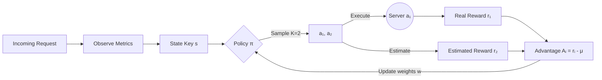

## Tiny GRPO for Traffic Routing

The smallest faithful GRPO loop, applied to web traffic routing, in ~200 lines of Go.

### What is GRPO?
__Group Relative Policy Optimization__ (GRPO) is a reinforcement learning algorithm that improves a policy by comparing outcomes within a group rather than against an external value function.

Different from PPO we don't need a critic because we are evaluating a new action relative to other actions that we tried.

```python
# pseudocode
actions = [sample(pi(s)) for _ in range(K)] # sample actions
rewards = [R(s, a) for a in actions]        

mean_r = sum(rewards) / K                   # group mean

for a, r in zip(actions, rewards):
    A = r - mean_r
    w[s][a] += lr * A * grad_log_pi(a, s)   # update policy
```

So actions better than the group mean get reinforced. Worse actions get supressed and we use the group mean as the baseline in this context this means no separate value network needed.

### Architecture


### Convergence
The tabular softmax policy with GRPO updates converges because i) advantage centering: eliminates baseline variance so only relative quality matters ii) softmax: ensures $\pi(a|s) > 0$ always $\rightarrow$ perpetual exploration prevents collapse and iii) clipping: bounds update magnitude $\rightarrow$ no single observation destabilizes the policy

With $K=2$, each step provides one pairwise comparison. Over many requests, the policy converges to the optimal server for each observed state. With a constant learning rate, the policy oscillates around the optimum, exactly what you want for a system that must adapt to shifting conditions.

## Go + GRPO for Routing

| GRPO Property | Routing Benefit |
|---|---|
| No value function | No second model to train, serve, or drift |
| On-policy | Adapts to current traffic, not last week's |
| Group-relative advantages | Robust to reward scale and noise |
| K=2 is sufficient | Minimal overhead per routing decision |

So Go seems like a natural fit.

### Reward Function

The formula for the reward function is

$$R = -(l(ms) + \alpha \cdot e_r \cdot 1000 + \beta \cdot q(ms))$$

where $l(ms), e_r$ and $q(ms)$ are the latency, error rate and queue respectively and $(\alpha, \beta)$ are weight constants that control the tradeoff.

## Quick Start

```bash
git clone https://github.com/you/tiny-grpo.git
cd tiny-grpo
go run .
```

## Example Output

```
╔══════════════════════════════════════╗
║   Tiny GRPO Load Balancer (Go)       ║
╚══════════════════════════════════════╝
backends=4  K=2  lr=0.02  α=2.0  β=0.5

Step  500 | π=[0.58 0.22 0.11 0.09] routes=[59% 21% 12% 8%]  avgR=-35.2 state=001
Step 1000 | π=[0.71 0.17 0.07 0.05] routes=[68% 18% 8% 6%]   avgR=-29.8 state=001

Server 0 degraded  (lat 20 -> 180ms, err 0.1%->6%)

Step 1500 | π=[0.12 0.45 0.22 0.21] routes=[46% 27% 12% 15%] avgR=-48.1 state=011
Step 2000 | π=[0.04 0.52 0.19 0.25] routes=[33% 31% 13% 23%] avgR=-52.3 state=011

Server 0 recovered (lat -> 20ms, err->0.1%)

Step 2500 | π=[0.31 0.34 0.17 0.18] routes=[38% 30% 13% 19%] avgR=-44.1 state=001
Step 3000 | π=[0.62 0.20 0.10 0.08] routes=[46% 28% 13% 13%] avgR=-37.6 state=001

┌──────────────────────────────────────────────────────────┐
│ Final Policy                                             │
├──────────────────────────────────────────────────────────┤
│ Server 0: 62.0% ██████████████████░░░░░░░░░░░░░░░░░░░░░ │
│ Server 1: 20.0% █████░░░░░░░░░░░░░░░░░░░░░░░░░░░░░░░░░ │
│ Server 2: 10.0% ██░░░░░░░░░░░░░░░░░░░░░░░░░░░░░░░░░░░░ │
│ Server 3:  8.0% █░░░░░░░░░░░░░░░░░░░░░░░░░░░░░░░░░░░░░ │
└──────────────────────────────────────────────────────────┘
```

The policy:
1. **Learns** Server 0 is best (steps 1–1000)
2. **Adapts** when Server 0 degrades (steps 1000–2000)
3. **Re-learns** when Server 0 recovers (steps 2000–3000)

Notice the state key changes from `001` -> `011` when Server 0 degrades (average latency crosses the 100ms bucket threshold). The policy starts fresh for the new state, this is tabular learning, not transfer. It re-discovers the best server from scratch, which is exactly what we want when conditions shift.


## Further Work

For this tiny version goroutines would add complexity, because the GRPO loop is sequential (sample, observe, update). Each step depends on the previous one within a single routing decision.

Also because we are not doing I/O there's no network call, no disk read. The "observe" step just reads in-memory structs.

But they are really easy toadd, if this were turned into a real HTTP reverse proxy, we'd have a goroutine per incoming request, using a gate (`sync.Mutex`) around the policy update would be enough, for example:

```go
func (rt *Router) Route() int {
    rt.mu.Lock()
    state := rt.aggregateState()
    a1 := rt.policy.Sample(state)
    a2 := rt.policy.Sample(state)
    rt.mu.Unlock()

    // Route to a1, observe r1 and r2 concurrently
    r1 := observe(a1)
    r2 := observe(a2)

    rt.mu.Lock()
    rt.policy.GRPOUpdate(state, a1, r1-mean)
    rt.policy.GRPOUpdate(state, a2, r2-mean)
    rt.mu.Unlock()

    return a1
}
```