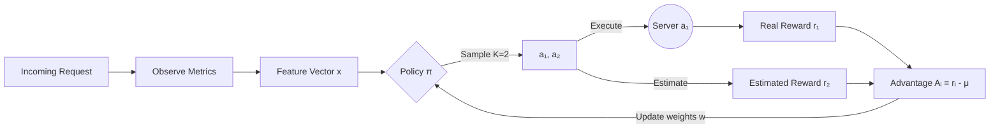

## Tiny GRPO for Traffic Routing

The smallest faithful GRPO loop, applied to web traffic routing, in ~200 lines of Go.

### What is GRPO?
__Group Relative Policy Optimization__ (GRPO) is a reinforcement learning algorithm that improves a policy by comparing outcomes within a group rather than against an external value function.

Different from PPO we don't need a critc because we are evaluating a new action relative to other actions that we tried.

```python
# pseudocode
actions = [sample(pi(s)) for _ in range(K)] # sample actions
rewards = [R(s, a) for a in actions]        

mean_r = sum(rewards) / K                   # group mean

for a, r in zip(actions, rewards):
    A = r - mean_r
    w[a] += lr * A * grad_log_pi(a, x)      # update policy weights
```

Actions better than the group mean get reinforced. Worse actions get suppressed. The group mean serves as the baseline, no separate value network needed.

### Architecture


### Policy: Linear Model

Instead of a lookup table keyed on bucketed state strings, the policy is a **linear model**: each action has a weight vector `w[a]` of the same dimension as the feature vector `x`, and the logit for action `a` is just their dot product:

$$\text{logit} = w[a] \cdot x, \quad \pi(a|x) = \text{softmax}(\text{logits})[a]$$


The feature vector is built directly from raw metrics, normalized to `[0, 1]`:

```go
x = [load, latencyMs/300, errorRate/0.10, queueMs/500]
```

This is an action space of 4 actions × 4 features = **16**

#### Why not a table?

A tabular policy buckets continuous metrics into discrete bins and uses the bin label as a lookup key. This loses magnitude information: a latency of 101ms and 299ms map to the same state and each new state combination starts learning from scratch with no transfer between nearby states.

The linear model sees the actual metric values, so it generalizes continuously: a policy that learned to avoid high-latency servers at `latencyMs=200` already has a sensible prior at `latencyMs=250`.

#### Gradients are analytic

For a linear-softmax model the policy gradient has a closed form, so no autograd is needed:

$$\frac{\partial \log \pi(a|x)}{\partial w[a'][f]} = \left(\mathbf{1}[a' = a] - \pi(a'|x)\right) \cdot x_f$$

The update rule per step is:

$$w[a][f] \mathrel{+}= \alpha \cdot A \cdot \left(\mathbf{1}[a = \text{chosen}] - \pi(a|x)\right) \cdot x_f$$

where $A = r - \bar{r}$ is the GRPO advantage. Because the features are bounded in `[0, 1]` and the learning rate is small, weights stay bounded naturally — no gradient clipping or weight clamping required.

### Convergence

The linear softmax policy with GRPO updates converges because:

1. **Advantage centering**: eliminates baseline variance so only relative quality matters.
2. **Softmax**: ensures $\pi(a|x) > 0$ always, so exploration never collapses.
3. **Bounded features**: with $x \in [0,1]^d$ and a small learning rate, weights and logits stay bounded without explicit clamping.

With $K=2$, each step provides one pairwise comparison. Over many requests, the policy converges to the optimal server for the current metric regime. With a constant learning rate it oscillates around the optimum, exactly what you want for a system that must adapt to shifting conditions.

## Go + GRPO for Routing

| GRPO Property | Routing Benefit |
|---|---|
| No value function | No second model to train, serve, or drift |
| On-policy | Adapts to current traffic, not last week's |
| Group-relative advantages | Robust to reward scale and noise |
| K=2 is sufficient | Minimal overhead per routing decision |
| Linear model | 16 floats of state, analytic gradients, no bucketing |

### Reward Function

$$R = -(l_{ms} + \alpha \cdot e_r \cdot 1000 + \beta \cdot q_{ms})$$

where $l_{ms}$, $e_r$ and $q_{ms}$ are latency, error rate and queue depth respectively, and $(\alpha, \beta)$ are weight constants that control the tradeoff.

## Quick Start

```bash
git clone https://github.com/you/tiny-grpo.git
cd tiny-grpo
go run .
```

## Example Output

```
╔════════════════════════════════════════════════╗
║            Tiny GRPO Load Balancer             ║
╚════════════════════════════════════════════════╝
servers=4  K=2  lr=0.01  ε=0.10  α=1.5  β=0.3

Step  500 | π=[87.8%  4.1%  4.1%  4.1%] avgR= -45.3 | load=0.05 lat=0.10 err=0.01 q=0.00

  Server 0 degraded  (lat 20→180ms, err 0.1%→6%)

Step 1000 | π=[25.0% 26.5% 23.5% 25.0%] avgR= -45.3 | load=0.08 lat=0.62 err=0.61 q=0.00
Step 1500 | π=[ 4.1% 87.8%  4.1%  4.1%] avgR= -76.9 | load=0.06 lat=0.61 err=0.60 q=0.00

  Server 0 recovered (lat→20ms, err→0.1%)

Step 2000 | π=[87.8%  4.1%  4.1%  4.1%] avgR= -80.2 | load=0.04 lat=0.09 err=0.01 q=0.00
Step 2500 | π=[87.8%  4.1%  4.1%  4.1%] avgR= -46.8 | load=0.03 lat=0.09 err=0.01 q=0.00
Step 3000 | π=[87.8%  4.1%  4.1%  4.1%] avgR= -47.3 | load=0.03 lat=0.08 err=0.01 q=0.00

Final Policy:
  Server 0:  87.8% ██████████████████████████░░░░
  Server 1:   4.1% █░░░░░░░░░░░░░░░░░░░░░░░░░░░░░
  Server 2:   4.1% █░░░░░░░░░░░░░░░░░░░░░░░░░░░░░
  Server 3:   4.1% █░░░░░░░░░░░░░░░░░░░░░░░░░░░░░
```

The policy:
1. **Learns** Server 0 is best (steps 1–1000)
2. **Adapts** when Server 0 degrades (steps 1000–2000)
3. **Re-learns** when Server 0 recovers (steps 2000–3000)

The state is now a continuous feature vector rather than a discrete bucket label, so the policy degrades and recovers smoothly as metric values shift — there is no discrete threshold to cross before re-learning begins.

## Further Work

For this tiny version goroutines would add complexity, because the GRPO loop is sequential (sample, observe, update). Each step depends on the previous one within a single routing decision.

Also because we are not doing I/O there's no network call, no disk read. The "observe" step just reads in-memory structs.

But they are easy to add. If this were turned into a real HTTP reverse proxy, we'd have a goroutine per incoming request, using a `sync.Mutex` around the policy update would be enough:

```go
func (rt *Router) Route() int {
    rt.mu.Lock()
    x := rt.aggregateFeatures()
    a1, a2 := rt.policy.SamplePair(x)
    rt.mu.Unlock()

    // Route to a1, observe r1 and r2 concurrently
    r1 := observe(a1)
    r2 := observe(a2)

    mean := (r1 + r2) / 2.0
    rt.mu.Lock()
    rt.policy.GRPOUpdate(x, a1, r1-mean)
    rt.policy.GRPOUpdate(x, a2, r2-mean)
    rt.mu.Unlock()

    return a1
}
```